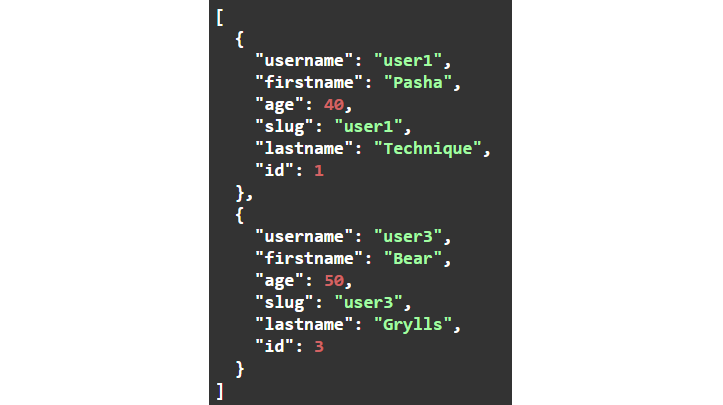
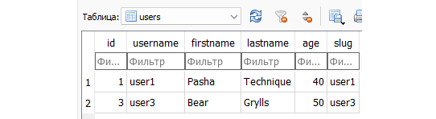

# HomeWork-4-Modul-17
# Домашнее задание по теме "Использование БД в маршрутизации. 1.1"
Цель: научиться управлять записями в БД используя SQLAlchemy и маршрутизацию FastAPI.

Задача "Маршрутизация пользователя":
Необходимо описать логику функций в user.py используя ранее написанные маршруты FastAPI.
## Подготовка:
Для этого задания установите в виртуальное окружение пакет  python-slugify.
Скачайте этот файл, в нём описана функция-генератор для подключения к БД. Добавьте его в директорию backend.
Подготовьтесь и импортируйте все необходимые классы и функции (ваши пути могут отличаться):
### from fastapi import APIRouter, Depends, status, HTTPException
#Сессия БД
### from sqlalchemy.orm import Session
#Функция подключения к БД
### from backend.db_depends import get_db
#Аннотации, Модели БД и Pydantic.
### from typing import Annotated
### from models import User
### from schemas import CreateUser, UpdateUser
#Функции работы с записями.
### from sqlalchemy import insert, select, update, delete
#Функция создания slug-строки
### from slugify import slugify

#### Напишите логику работы функций маршрутов:         

Каждая из нижеперечисленных функций подключается к базе данных в момент обращения при помощи функции get_db - Annotated[Session, Depends(get_db)]
### Функция all_users ('/'):
    1. Должна возвращать список всех пользователей из БД. Используйте scalars, select и all
##### Функция user_by_id ('/user_id'):
####### Для извлечения записи используйте ранее импортированную функцию select.
    1. Дополнительно принимает user_id.
    2. Выбирает одного пользователя из БД.
    3. Если пользователь не None, то возвращает его.
    4. В противном случае выбрасывает исключение с кодом 404 и описанием "User was not found"
### Функция craete_user ('/create'):
Для добавления используйте ранее импортированную функцию insert.
    1. Дополнительно принимает модель CreateUser.
    2. Подставляет в таблицу User запись значениями указанными в CreateUser.
    3. В конце возвращает словарь {'status_code': status.HTTP_201_CREATED, 'transaction': 'Successful'}
    4. Обработку исключения существующего пользователя по user_id или username можете сделать по желанию.
### Функция update_user ('/update'):
Для обновления используйте ранее импортированную функцию update.
    1. Дополнительно принимает модель UpdateUser и user_id.
    2. Если находит пользователя с user_id, то заменяет эту запись значениям из модели UpdateUser. Далее возвращает словарь {'status_code': status.HTTP_200_OK, 'transaction': 'User update is successful!'}
    3. В противном случае выбрасывает исключение с кодом 404 и описанием "User was not found"
### Функция delete_user ('/delete'):
Для удаления используйте ранее импортированную функцию delete.
    1.Всё должно работать аналогично функции update_user, только объект удаляется.
    2. Исключение выбрасывать то же.
## Создайте, измените и удалите записи через интерфейс Swagger:
### Создайте 3 записи User с соответствующими параметрами:
    1. username: user1, user2, user3
    2. firstname: Pasha, Roza, Alex
    3. lastname: Technique, Syabitova, Unknown
    4. age: 40, 62, 25
Измените запись с id=3: firstname = Bear, lastname = Grylls, age = 50
Удалите запись с id =2.
Выведите всех пользователей.
Проверьте, выбрасываются ли исключения в ваших запросах.
## Пример результата выполнения программы:
После всех запросов, все пользователи в Swagger должны выглядеть так:

В таблице users должны быть такие записи:

